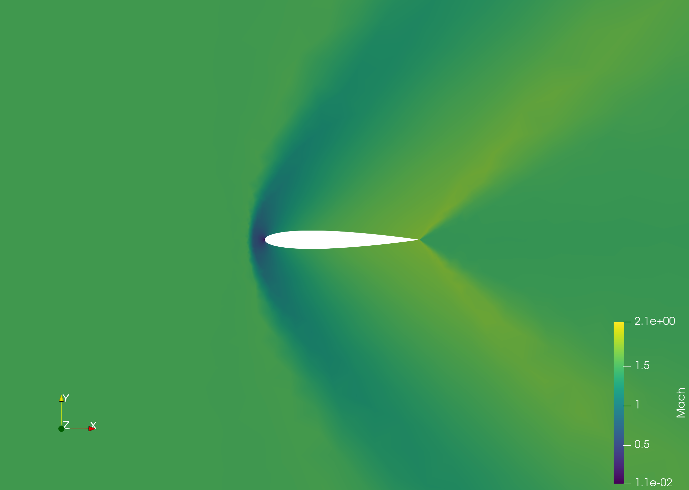
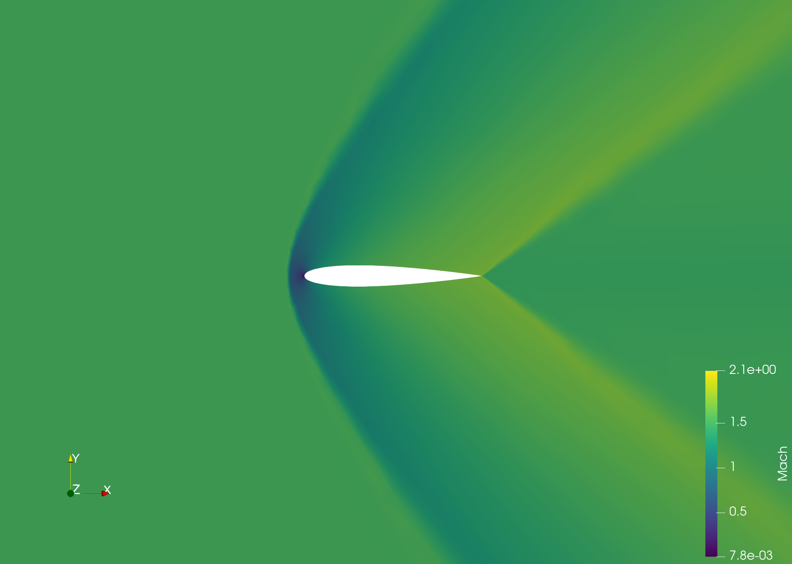
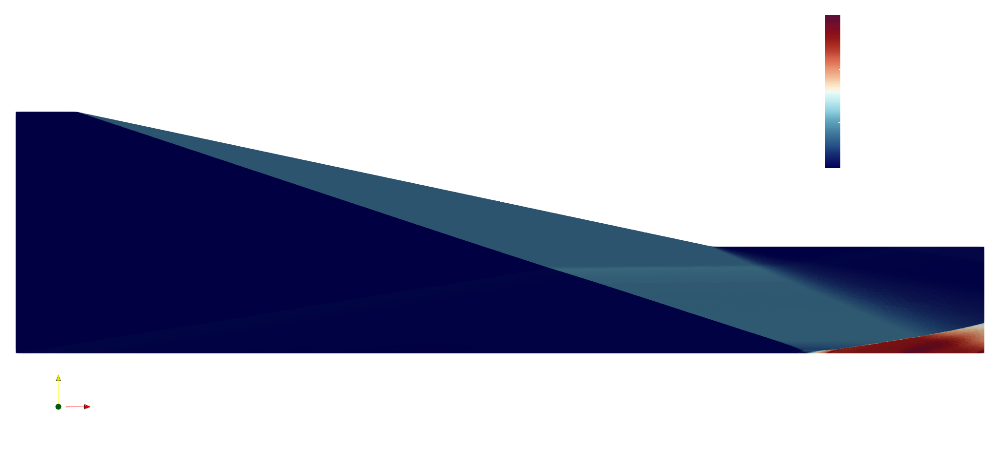

# Metric Based Grid Adaptation Using SU2 And NASA/Refine
This repository contains the flow simulation results, meshes, configuration files, and certain small codes written in C++ for postprocessing.

## Get Started
Install the [SU2 package](https://su2code.github.io/) to solve flow simulations and [NASA/Refine](https://github.com/nasa/refine) to run the adaptation cycles.
General recommendation is to install SU2 and refine from source with MPI support (provided by openmpi or [MPICH](https://www.mpich.org/)). Packages have a long dependency list so make sure you read the instructions provided on their documentation/manpages carefully.

## Using SU2
Once installed, using SU2 is really easy. Start with running a couple of test cases and get a hold of the configuration options. An exhaustive list (it is really, really long) of available configuration options are listed with a brief description in the [config_template.cfg](https://github.com/su2code/SU2/blob/master/config_template.cfg) file. Not all configuration options need to be explored, find the relevant ones in your specific [testcases folder](https://github.com/su2code/TestCases) with relevant *.su2 grid files and start getting familiar with the usage.
Run SU2 from the terminal using the command
```
$ SU2_CFD config_filename.cfg
```
for serial processing and
```
$ mpirun -n $NP SU2_CFD config_filename.cfg
```
for parallel processing. `$NP` is the number of processes (threads) you wish to run. It should ideally not exceed the total number of processors and should be a multiple of 2.

It is also recommended to set the **OUTPUT_FILES** variable to output **RESTART_ASCII** instead of **RESTART** (which is in binary format) in order to post-process the solution.

For most cases we will also compare the drag and lift values with a verified source so it is important for us to output aerodynamic coefficients in the solution as well. To do that one just has to edit the **HISTORY_OUTPUT** parameter in the configuration file to **(ITER, RMS_RES, AERO_COEFF)** which puts out all the iteration numbers, residuals, and lift, drag, moment, and several other coefficients.

## Post Processing The SU2 Output Files
The repository has a C++ code that can be used to postprocess the output file generated by SU2. The default setting is for a 3D simulation for inviscid compressible flows. If your case matches the default setting just compile `getScalarSolutionFiles.cpp` without any extra flags using g++
```
$ g++ getScalarSolutionFiles.cpp -o OutputFileName
```
and run the binary output. Please note that you need to know the number of points in the mesh (and hence the solution) since the code does not automatically find it for you and create a folder titled `sol` in the same directory. The number of points is one less than the number of lines in the **restart_flow.csv** output file. Use
```
$ wc -l restart_flow.csv
```
to find the total number of lines and subtract one from the output.

The same code can also be run for two extra cases:
1. A Viscous flow simulation
2. 2D flow simulation.

Specific macros can be defined while compiling the code to match your case. Use the macro `TWOD` for a 2D flow and `VISCOUS` for a Viscous flow simulation. To use both of them you can compile the program like so:
```
$ g++ getScalarSolutionFiles.cpp -DTWOD -DVISCOUS -o 2d_viscous_solutions
```

Running the generated binary will create 9 solution files (8 for 2D) in the `sol` folder which can be later used to create the metric field and further adapt the grid using NASA/Refine. In this project we have used Mach Number to generate the metric fields.

## Creating an EGADS geometry
It is important to know how to create an EGADS geometry for any case one is trying to run before they get started with NASA/Refine. The importance comes from the fact that Refine will try to modify the grid even at the boundaries depending on the flow solution. If geometry data is not provided, Refine will use linear interpolation to place points between two previous points. This should practically be fine for certain cases but one needs to keep in mind that these new points DO NOT lie on the original curve of the geometry. As a result, if the starting grid is very course, which it should be, the final adapted grid after a few iterations will not lie on the intended boundary whatsoever.

Refine reads geometries in EGADS format and in this section a brief introduction will be given on how to generate an EGADS file. When starting a geometry from scratch, one can just go to their preferred CAD software and create a geometry (with the fluid domain, preferably) and export a STEP file. Once the STEP file is created, a simple CSM script can be used to convert it to an EGADS format. This is the simplest way because a STEP file for a standard testcase geometries is usually available online and does not need to be created from scratch. Once obtained, the CSM file can be written contains three simple lines.

```
# import the step file
import geometry.step 1

# dump the data in an egads format
dump geometry.egads

# end the script
end
```

To run the csm file keep the files in the same folder and run the following command in the terminal. OpenCSM will be installed in your system as a part of Engineering Sketch Pad. No extra steps are needed for its installation.

```
serveESP geometry.csm
```

There are a lot more options in a csm file and for any advanced options one should refer to the [OpenCSM Documentation](https://acdl.mit.edu/esp/Publications/AIAApaper2013-0701.pdf) and the UGAWG example [CSM file for the Onera M6 Wing case](https://raw.githubusercontent.com/UGAWG/solution-adapt-cases/master/onera-m6/geometry/onera-m6-sharp-te.csm).

## Using NASA/Refine
Refine is a simple yet powerful tool which can be used to create metric fields, adapt grids, translate grids from one format to another, and much more. You need the following files to create a metric field and adapt a grid:
1. The mesh/grid file
2. The geometry file in EGADS format (to adapt a grid)
3. The solution field (to generate a metric field) or the metric field (to adapt a grid)

### Generating The Very First Grid Using An EGADS Geometry

One can start with a very basic and course grid that fits the geometry of model. Use the following command to generate the initial grid:
```
$ ref bootstrap geometry_title.egads
```
The program will generate several output files suffixed with the geometry file name (`geometry_title` in the current example). Look for `*-vol.meshb` file (`geometry_title-vol.meshb` in the current example) which can be translated to *.su2 format later on and used in the solver.

> NOTE: You can also use multiple mpi ranks for most refine tasks by replacing the command `ref` with the command `mpirun -n $NP refmpifull` where `$NP` is the number of processes (threads) you want to use


### Converting The Mesh To SU2 Format

SU2 has a mesh format of its own and cannot read a `*.meshb` file which makes it an important step for us to translate the volume mesh obtained from the step above to a usable format. Use the following command:
```
$ ref translate input-volume-mesh.meshb output-volume-mesh.su2
```

> NOTE: There is a good chance that you may need to edit the su2 grid file to some extent in order to use it since refine translates the grid and does not combine identical surfaces into the same marker (For example there may be three markers numbered 3, 4, and 5 which are all adiabetic walls). You can find out the number of markers by using the `grep` command like so:
 
> ```
> $ grep -i nmark gridfile.su2
> ```

> If the number is higher than what you have expected it to be, you may need to combine a few markers into one and edit the numbers accordingly. The su2 mesh format is explained in their documentation [here](https://su2code.github.io/docs_v7/Mesh-File/) and should be referred to before making any changes to the file.

> ***Taking a backup of the original grid file is highly recommended before any edits are made since any mistake in the grid file may render it useless.***

### Editing The SU2 Grid File

Open the su2 grid file in a text editor and find the string **MARKER_TAG** which will be followed by another string **MARKER_ELEMS**. These two strings will be followed by several lines which hold the boundary data. You need to merge the boundary data of all the markers that are of the same boundary condition and change **MARKER_ELEMS** to the total number of elements that the marker now has (sum of all the merged markers).

Change the **NMARK** number accordingly too and the new grid should be good to go. You can also change the name of **MARKER_TAG** if you wish to so that it can be identified easily. It is not important and can be skipped.

Example:

For a square grid used as an example in [mesh file docs](https://su2code.github.io/docs_v7/Mesh-File/) the marker definition looks like so:
```
NMARK= 4
MARKER_TAG= lower
MARKER_ELEMS= 2
3 0 1
3 1 2
MARKER_TAG= right
MARKER_ELEMS= 2
3 2 5
3 5 8
MARKER_TAG= upper
MARKER_ELEMS= 2
3 8 7
3 7 6
MARKER_TAG= left
MARKER_ELEMS= 2
3 6 3
3 3 0
```
Let us say we want to merge the `upper` and `lower` surfaces and name the new marker as `horizontal`. We may do so by adding the elements of `upper` to `lower`, changing the **MARKER_TAG** to `horizontal`, changing **MARKER_ELEMS** from 2 to 4, and finally changing **NMARK** from 4 to 3. The new marker definition will look like so:

```
NMARK= 3
MARKER_TAG= horizontal
MARKER_ELEMS= 4
3 0 1
3 1 2
3 8 7
3 7 6
MARKER_TAG= right
MARKER_ELEMS= 2
3 2 5
3 5 8
MARKER_TAG= left
MARKER_ELEMS= 2
3 6 3
3 3 0
```

### Generating A Metric Field

The first task after receiving the solution fields from the post-processing code is to generate a metric field. The metric field will dictate the placement of new points and refinement of features in the adaptation cycle. You need a solution field to generate a metric field using refine. We have used Mach Number in all our testcases as the solution field. The `ref multiscale` command can be used to generate the metric field like so:

```
$ ref multiscale inputmesh.meshb ./sol/mach.sol $COMPLEXITY output-metric.solb
```
where the `$COMPLEXITY` is approximately half the number of target points in the new grid. The generated metric field can then be used too adapt the existing grid.

> NOTE: The general recommendation is to use the same complexity for 5-7 grid adaptation cycles until the mesh stops changing much and then increase the complexity by a factor ranging from 1.5 to 2.0.

### Adapting The Grid

This is the final step of the adaptation cycle before you start pre-processing for the solver. Not much to do here, just use the metric field generated in the step above and the egads geometry to ensure the new points get placed onto the geometry surface to adapt the grid. The command is:

```
$ ref adapt input-mesh.meshb --egads geometry-file.egads -m metric-field.solb -x output-adapted-mesh.meshb
```

After the adapted grid is generated you can convert it to SU2 format using the translate command discussed earlier. Check the su2 mesh file for any required changes. If it does, head over to [Editing the SU2 Grid File](#editing-the-su2-grid-file) and implement those changes. After that you are good to go.

## Using EILMER with NASA/Refine

[EILMER](https://gdtk.uqcloud.net/docs/eilmer/about/) is another open source solver that is specifically designed to handle hypersonic flow. The solver is incredibly robust and brilliantly documented in its [reference manual](https://gdtk.uqcloud.net/docs/eilmer/eilmer-reference-manual/) and [user guides](https://gdtk.uqcloud.net/docs/eilmer/user-guide/). Everything one needs to know about the solver can be found on their pages linked above and hence will not be discussed here. Our area of focus will be around using EILMER with NASA/Refine and trying to run a few adaptation cycles.

The first thing one needs to know is that EILMER does not have a restart flow file in ASCII format that can be easily read like SU2 does. Paraview needs to be used to extract field data and `*.sol` files needed for metric field generation need to be manually created.

The second thing is that EILMER stores values as cell center values and not at nodes. So we need to interpolate the values from cells to points in order to use Refine for adaptation.

Easiest way to do this is to load the `*.vtk` file generated from the post-processor of EILMER in paraview and extract the data using the following steps. Just note that the post-processor does not add mach number by default and you need to add `--add-vars="mach"` to the post processing command.

1. Interpolating cell data to point data: In the menubar, go to **Filters -> Alphabetical -> Cell data to point data**
2. Set up data extractor: In the menu bar, go to **Extractors -> Data -> CSV**, set up the parameters (recommendations: value for precision is 16 and to enable scientific notation)
3. Save the extracted data: To save the dataset go to **File -> Save Extracts**. Set the folder for the extract (by default in the current directory under `extracts`) and save the dataset.

Once the csv file is generated with the data, the `*.sol` file can now be manually created.

> NOTE: Since these points are extrapolated from cell data, the coordinates of the points would very slightly vary from the original values in the grid files. This is inconsequential and can be ignored for all practical purposes. The first few decimal places will match and that should give a brief idea of where the point is and would uniquely resemble its corresponding point.

### Creating the solution file

The sol file follows a very simple format.
```
MeshVersionFormatted 1

Dimension $DIM

SolAtVertices
$NUMBER_OF_POINTS
1 1

.
.
.
.
.

END
```
For our case we don't need to know what most numbers and values mean here. We only need to change **$DIM** and **$NUMBER_OF_POINTS** for our case. Change **$DIM** to **2** for 2D and **3** for 3D simulations. And replace the **$NUMBER_OF_POINTS** variables to the number of points present in the grid. After that fill up the dotted line with the scalar data (usually it is a column of mach numbers) and end the file with a string "END" on a new line. We have our solution file.

> NOTE: The scalar data is arranged point-wise from first to last in the order of points in the grid file. I have never encountered a different order in the CSV file but one should roughly check if the points are arranged in the csv file in the same order as the grid file.

## Testcase Results - Inviscid Transonic Flow Over NACA0012 Airfoil [2D]
The flow over a 2D NACA Airfoil is done with the following flow conditions:

| Physical Quantity      | Value     |
| ---------------------- | --------- |
| Mach Number            | 0.8       |
| Angle of Attack        | 1.25      |
| Freestream Pressure    | 101325 Pa |
| Freestream Temperature | 288.15 K  |

The [configuration file](naca0012/Transonic/naca0012_00/inv_NACA0012.cfg) was tweaked a little bit for better residual convergence. The important bits are the convective fluxes and the multigrid methods used in the present case. We have used the JST scheme to split the flux with the **2nd and 4th order coefficients as 0.5 and 0.02** respectively which are the default values. If the residuals oscillate or fail to converge beyond a particular magnitude, one can increase the values of the dissipation coefficients little by little and try to find the sweet spot for a particular flow simulation. This is bound to happen and it is only a matter of "when" rather than "if" as the grid adapts to the solution more and more. Finer grids have lower dissipation so you may have to increase the artificial dissipation through the sensor coefficients in order to get a converged solution.

> NOTE: JST Scheme also over-predicts drag values so if the solution converges well, I suggest you decrease the sensor coefficients a little bit and observe the limit at which it starts showing convergence issues and then slowly increase it from there to get smooth convergence. This is to make sure we do not have excess dissipation in the solution and values are as close to the verified sources as they can be. It is an extra consideration and has been done in [3D Onera M6 Wing Testcase](#testcase-results---inviscid-transonic-flow-over-onera-m6-wing-3d)

The multigrid parameters are not tinkered with a lot. Only the level has been set to 3 and the other values are taken by default from the [configuration file in SU2 testcase folder](https://github.com/su2code/SU2/blob/master/TestCases/euler/naca0012/inv_NACA0012.cfg).

Lastly, one needs to make sure all the important parameters are printed out so that results can be compared so make sure you have put out aerodynamic coefficient values in the history files as well. Refer to the [Using SU2 section](#using-su2) to know how to do it.

### Grid Refinement
|  |  |
| ---- | ---- |
|  |  |
|  |  |
|  |  |

### Pressure Fields
|  |  |
| ----: | :---- |
|  |  |
|  |  |
|  |  |

## Testcase Results - Inviscid Transonic Flow Over Onera M6 Wing [3D]

The flow over a 3D Onera M6 Wing is done with the following flow conditions:

| Physical Quantity      | Value     |
| ---------------------- | --------- |
| Mach Number            | 0.8395    |
| Angle of Attack        | 3.06      |
| Freestream Pressure    | 101325 Pa |
| Freestream Temperature | 288.15 K  |

All the configuration files options, tweaks, and conditions here are similar to the [NACA0012 2D case](#testcase-results---inviscid-transonic-flow-over-naca0012-airfoil-2d). I suggest you read the section properly before moving forward with the current test case.

The **JST 2nd and 4th order sensor coefficients** in this test case were **0.1 and 0.01** respectively and have been mildly tweaked in subsequent adaptation cycles.

This case has been run for 12 adaptation cycles and every even adaptation is shown.

### Grid Refinement

|  |  |
| ---- | ---- |
|  |  |
|  |  |
|  |  |

### Pressure Fields

|  |  |
| ---- | ---- |
|  |  |
|  |  |
|  |  |

## Testcase Results - Turbulent Transonic Flow Over Onera M6 Wing [3D]

The flow over a 3D Onera M6 Wing is done with the following flow conditions:

| Physical Quantity      | Value     |
| ---------------------- | --------- |
| Mach Number            | 0.8395    |
| Angle of Attack        | 3.06      |
| Freestream Pressure    | 101325 Pa |
| Freestream Temperature | 288.15 K  |

The [basic configuration file](Turbulent%20Onera%20M6%20Wing/Onera00/turb_ONERAM6.cfg) can be found and referred to for reproducing the simulation.

### Grid Refinement

|  |  |
| ---- | ---- |
|  |  |
|  |  |
|  |  |
|  |  |
|  |  |
|  |  |

### Pressure Fields

|  |  |
| ---- | ---- |
|  |  |
|  |  |
|  |  |
|  |  |
|  |  |
|  |  |

## Testcase Results - Hypersonic flow over a Cylinder (HEG Cylinder) [2D] [SU2-NEMO]

This is a testcase whose results have been published by the developers of SU2 NEMO (Non Equilibrium MOdels), the hypersonic solver for SU2, to demonstrate the robustness of their solver. The original study from 2012 is linked [here](https://doi.org/10.2514/6.2003-4252) and the results by SU2 are linked [here](http://dx.doi.org/10.3390/aerospace8070193).

### Results

| Grid | Mach | Pressure |
| ---- | ---- | ---- |
|  |  |  |
|  |  |  |
|  |  |  |
|  |  |  |
|  |  |  |
|  |  |  |

## Refine Adaptation on Hybrid Meshes

Refine treats the grid a little differently when the grid is a hybrid mesh, i.e. Quads+Triangles for a 2D case and Prisms+Tetrahedras for a 3D one. Refine does not modify/adapt the cells which are quads/prisms and works on the other "unstructured" elements near the features necessary for adaptation. There are no extra flags or commands required for hybrid meshes; use the refine command as you would for a standard mesh and the package will take care of the rest.

 Below are a few examples of the 2D cases run with a hybrid mesh.

> NOTE: To create these hybrid meshes one can create/import a standard unstructured grid in Pointwise and run the T-Rex solver with "Quads + Tris" enabled for 2D and "Prisms + Tets" enabled for 3D. Do make sure that you have applied the boundary conditions for the wall (eg. first cell height, max layers) correctly for the T-Rex solver otherwise you might ruin the previous mesh. Creating a backup copy before one starts modifying a grid is advised.

### Triangle and Quads - NACA0012 Testcases

Close up of the thin boundary layer created with quads for a 2D NACA0012 airfoil


#### Inviscid Transonic

| Grid | Mach | Pressure |
| ---- | ---- | ---- |
|  |  |  |
|  |  |  |
|  |  |  |
|  |  |  |

Here is a small example of how the grid changes near the quads for a 2D mesh:

|  |  |
| ---- | ---- |
|  |  |
|  |  |


#### Inviscid Supersonic

| Grid | Mach | Pressure |
| ---- | ---- | ---- |
|  |  |  |
|  |  |  |
|  |  |  |
|  |  |  |

#### Laminar Subsonic

| Grid | Mach | Pressure |
| ---- | ---- | ---- |
|  |  |  |
|  |  |  |
|  |  |  |

## Testcase results with EILMER with Refine - Shockwave Boundary Layer Interaction [2D]

This is a shockwave boundary layer interaction at Mach 7 problem which is a testcase given in Eilmer's example folder.

| Grid | Mach | Pressure |
| ---- | ---- | ---- |
|  |  |  |
|  |  |  |
|  |  |  |

The way in which Refine has adapted the grid around every single feature in the flow domain is very easily visible. Cells are concentrated near the shockwaves and the shock interactions and reflections, the expansion waves being bent and interacting with the shocks, the free sheer jet originating from the point of contact of two shockwaves, all of these features have been refined as a part of the adaptation
